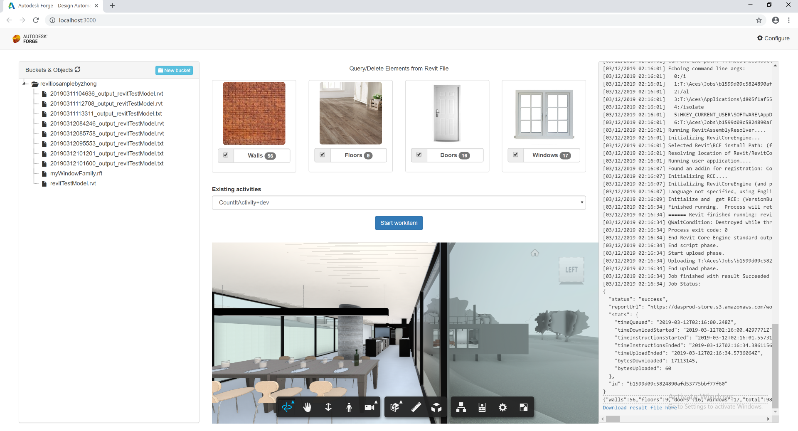

# design.automation-csharp-revit.count.delete

# Description

_CountDelete_ is a sample application that counts and deletes Revit elements in a host and link model using the Design Automation API for Revit. 

This sample is based on Learn Forge [Learn Forge Tutorial](http://learnforge.autodesk.io/#/tutorials/modifymodels), the workflow is pretty similar, please make sure to go through that sample first, or you are already familiar with that. 

This sample includes 2 Revit plugin projects, `CountIt` and `DeleteElement`, which are referenced at the `CountIt` & `DeleteWalls` [tutorial](https://forge.autodesk.com/en/docs/design-automation/v3/tutorials/revit-samples/). This include a few improvement to `DeleteWalls` sample to support deleting different types of elements(Walls, Floors, Doors, Windows) based on the input json file, and renamed the Revit plugin project to `DeleteElements`.

The sample also integrates the bucket jstree and viewer from [Learn Forge Tutorial](http://learnforge.autodesk.io/#/tutorials/viewmodels) for viewing models ([.NET version](https://github.com/Autodesk-Forge/learn.forge.viewmodels/tree/net)) to get the input revit file from the bucket, and also put the result file back to the same bucket. The result files are different based on different `activities`, a `.txt` file for `CountIt`, and an modified `.rvt` file for `DeleteElements`.

## Thumbnail

# Setup

## Prerequisites

1. **Forge Account**: Learn how to create a Forge Account, activate subscription and create an app at [this tutorial](http://learnforge.autodesk.io/#/account/). 
2. **Visual Studio**: Either Community (Windows) or Code (Windows, MacOS).
3. **.NET Core** basic knowledge with C#
4. **ngrok**: Routing tool, [download here](https://ngrok.com/)
7. **Revit** 2019: required to compile changes into the plugin

## Running locally

Clone this project or download it. It's recommended to install [GitHub desktop](https://desktop.github.com/). To clone it via command line, use the following (**Terminal** on MacOSX/Linux, **Git Shell** on Windows):

    git clone https://github.com/Autodesk-Forge/design.automation-csharp-revit.count.delete
    
**ngrok**

Run `ngrok http 3000 -host-header="localhost:3000"` to create a tunnel to your local machine, then copy the address into the `FORGE_WEBHOOK_URL` environment variable.

**Visual Studio** (Windows):

Right-click on the project, then go to **Debug**. Adjust the settings as shown below. 

 

The environment variables you need to set should be as above, most of them are same as detailed in [Design Automation Sample Tutorial](http://learnforge.autodesk.io/#/environment/setup/netcore). The only one you need to notice is `FORGE_DESIGN_AUTOMATION_NICKNAME`, if you already set a `NickName` for your Forge App, e.g. revitiomycompanyname, please input the value of `NickName` here, if you don't set a `NickName`, you can ignore this environment variable, just leave it as it is.

- `ASPNETCORE_ENVIRONMENT`: `Development`,
- `ASPNETCORE_URLS` : `http://localhost:3000`,
- `FORGE_CLIENT_ID`: `Your Forge App Client Id`,
- `FORGE_CLIENT_SECRET`: `Your Forge App Client Secret`,
- `FORGE_WEBHOOK_URL`: `your ngrok address here: e.g. http://abcd1234.ngrok.io`,
- `FORGE_DESIGN_AUTOMATION_NICKNAME`: ``, 

**Revit plugin**

A compiled version of the `Revit` plugins (.bundles) are included on the `WebApp` module, under `wwwroot/bundles` folder. Any changes on these plugins will require to create a new .bundle, the **Post-build** event should create it. Please review the readme for [CountItApp](https://github.com/JohnOnSoftware/design.automation-csharp-revit.count.delete/tree/master/CountItApp) & [DeleteElementsApp](https://github.com/JohnOnSoftware/design.automation-csharp-revit.count.delete/tree/master/DeleteElementsApp)

Start the app from Visual Studio (or Visual Code).

Open `http://localhost:3000` to start the app. 

**To use the sample, the workflow should be:**

1. Build the solution to create 2 AppBundle under `wwwroot/bundles`;
2. Create/Update AppBundle & Activity in `Configure` dialog;
3. Create a bucket and upload a Revit project file;
4. Select a Revit project file, translate it and open it in Forge viewer;
5. Select different element types you want to Count/Delete, select activity, click `Start workitem` to post a workitem.
6. The result file(`.txt` or `.rvt`) will be put in the same bucket, you can translate and view it, or you can download the file to check out.

# Further Reading

Documentation:

- [Data Management API](https://developer.autodesk.com/en/docs/data/v2/overview/)
- [Model Derivative API](https://forge.autodesk.com/en/docs/model-derivative/v2/)
- [Design Automation v3](https://forge.autodesk.com/en/docs/design-automation/v3/developers_guide/overview/)

Desktop APIs:

- [Revit](https://knowledge.autodesk.com/support/revit-products/learn-explore/caas/simplecontent/content/my-first-revit-plug-overview.html)

### Known Issues

- Sometimes you may fail to delete some Revit element depends on the Revit project file. 

### Tips & Tricks

This sample uses .NET Core and should work fine on both Windows and MacOS, did not verify on MacOS yet, but you can check [this tutorial for MacOS](https://github.com/augustogoncalves/dotnetcoreheroku) if you want to try.

## License

This sample is licensed under the terms of the [MIT License](http://opensource.org/licenses/MIT). Please see the [LICENSE](LICENSE) file for full details.

## Written by

Zhong Wu, [Forge Partner Development](http://forge.autodesk.com)
